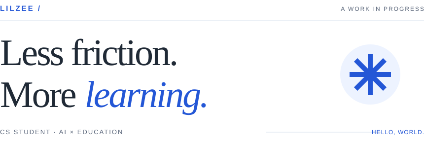

<picture>
  <source media="(prefers-color-scheme: dark)" srcset="./assets/editorial-header-dark.svg">
  
</picture>

### Hey, I'm Zee.

我在探索 **AI × Education**，也做一些让学习和创作更顺手的小工具。  
从对话式课堂、知识 Wiki，到数据结构课程与 UML —— 把想法做出来，再慢慢打磨。

[Projects](https://github.com/LilZeeCN?tab=repositories) · [Email](mailto:2453972231@qq.com)

 

01 / SELECTED WORK

## A few things I've built.

<table>
<tr>
<td width="50%" valign="top">
01 — AI LEARNING
<h3><a href="https://github.com/LilZeeCN/interactive-tutor">interactive-tutor ↗</a></h3>

不止回答问题，而是陪你学会。 AI 一对一课堂，串起课程大纲、代码实验和项目练习。

TypeScript · React · Express
</td>
<td width="50%" valign="top">
02 — CREATIVE TOOLS
<h3><a href="https://github.com/LilZeeCN/easy-uml">easy-uml ↗</a></h3>

把脑海里的结构，变成图。 用自然语言生成 UML，支持 11 种图表类型与 SVG 导出。

TypeScript · Next.js · DeepSeek
</td>
</tr>
<tr>
<td width="50%" valign="top">
03 — OPEN EDUCATION
<h3><a href="https://github.com/LilZeeCN/cs61b-cn">cs61b-cn ↗</a></h3>

少一点语言障碍，多一点动手。 UC Berkeley CS 61B 课程骨架代码中文化，开箱即可练习。

Java · Data Structures · 中文化
</td>
<td width="50%" valign="top">
04 — KNOWLEDGE TOOLS
<h3><a href="https://github.com/LilZeeCN/zee-tutor">zee-tutor ↗</a></h3>

让一次对话，长成一套知识。 面向 Claude Code 的学习 Skill，用互相链接的 Wiki 组织知识。

Claude Code · Wiki · Learning
</td>
</tr>
</table>

 

02 / THE THREAD

### 让 AI 学会如何教学。

这是这些项目背后，同一个想继续探索的问题。

---

Built with curiosity. Shared with you. &nbsp; / &nbsp; <a href="mailto:2453972231@qq.com">Say hello ↗</a>
